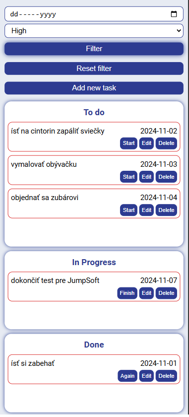

# ToDoApp Jumpsoft

ToDoApp je jednoduchá aplikácia na správu úloh (To-Do list), ktorá umožňuje používateľovi pridávať, upravovať a odstraňovať úlohy.
Aplikácia je postavená na technológiách Node.js (v21.6.2) a React.

## Funkcie

- Pridanie úlohy: popis úlohy, dátum dokončenia, priorita úlohy.
- Filtrovanie všetkých úloh podľa dátumu a priority.
- Farebné zvýraznenie úloh podľa priority.
- Úprava existujúcej úlohy.
- Odstránenie úlohy.
- Uloženie zoznamu úloh do localStorage.

## Krátky popis funkčnosti

Po spustení aplikácia skontroluje, či v `localStorage` existujú staršie záznamy. Ak áno, tieto záznamy načíta do premennej vo forme zoznamu/poľa objektov.
Aplikácia umožňuje pridať novú úlohu s parametrami: popis úlohy, dátum dokončenia a priorita úlohy.
Po pridaní novej úlohy aplikácia pridá úlohe ID a stav „TODO”, aktualizuje zoznam úloh a zoradí ho podľa dátumu a priority.
Aktualizovaný zoznam sa uloží do `localStorage` a úlohy sa na základe ich stavu (TODO, IN_PROGRESS, COMPLETE) zobrazia v troch stĺpcoch.

Pri opakovaní úlohy (po kliknutí na "Again") program zkontroluje deadline úlohy, ak je v minulosti, dátum nastaví na aktuálny.

Každá úloha obsahuje 3 tlačidlá:

1. Prepínanie stavu: To Do -> In Progress -> Complete -> Again.
2. Úprava úlohy.
3. Vymazanie úlohy zo zoznamu.

## Screen z aplikácie

Zoznam úloh:


"PopUp" okno pre pridanie úlohy a editáciu existujúcej úlohy:


Mobilné zobrazenie filtrovaných úloh s vysokou prioritou:



## Spustenie projektu

1. Stiahni si ZIP repozitára a rozbaľ ho.
2. Prejdi do adresára projektu:

   ```
   cd ToDoApp-jumpsoft
   ```

3. Nainštaluj potrebné závislosi:

   ```
   npm install
   ```

4. Spusti aplikáciu
   ```
   npm start
   ```
   Aplikácia sa spustí vo webovom prehliadači na http://localhost:3000 .

Po spustení môžeš začať pridávať nové úlohy.
Ak aplikáciu spustíš opakovane, zoznam predchádzajúcich úloh sa načíta z `localStorage` pre túto URL adresu.
